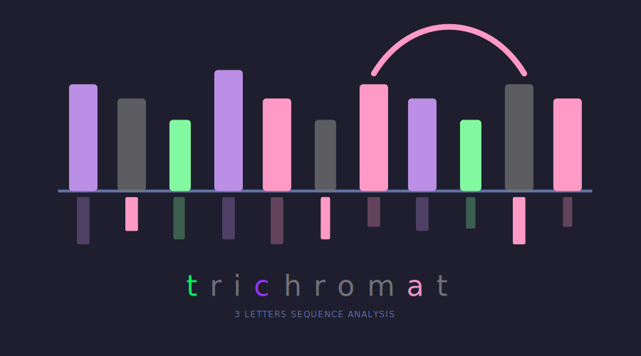

# trichromat

    

_🧬 A general pipeline for data processing of 3 letter sequencing methods._

## ✨ Pipeline Power-Ups ✨

- **✂️ Clean Reads with Built-in & Custom Options**

  - Auto-detects & removes adapters.
  - Built-in support for multiple library preparation schemes
  - Supports your custom adapters.
  - Optional contamination reads removal.
  - Mask high abundant reads (rRNA, spike-in oligo, ...) before genome alignment.

- **⚡ Processes Single-End (SE) & Paired-End (PE) Sequencing Data Simultaneously**

  - Handles both SE and PE reads.
  - Mixed SE and PE reads for one sample is also supported.
  - Use for various sequencing projects.

- **➕ Auto-Combines Data from Multiple Sequencing Runs**

  - Joins data from multiple runs for one sample.
  - Creates a single, complete dataset.
  - Report the combine process in the final report.

- **🚀 Simplified, Fast & Resource-Efficient Processing**
  - Turns complex steps into easy ones.
  - Built for speed.
  - Parameterized for efficiency.

## Dependencies

- [cutseq](https://github.com/y9c/cutseq)
- [samtools](https://github.com/samtools/samtools)
- [hisat3n](https://github.com/DaehwanKimLab/hisat2/tree/hisat-3n)
- [umicollapse](https://github.com/Daniel-Liu-c0deb0t/UMICollapse)
- [markduplicates](https://gatk.broadinstitute.org/hc/en-us/articles/360037052812-MarkDuplicates-Picard)
- [pbr](https://github.com/y9c/pbr)
- python: 3.10+ (and dependencies below)
  - scipy: 1.12.0+
  - polar: 1.30.0+

---

&nbsp;

Copyright &copy; 2025-present
<a href="https://github.com/y9c" target="_blank">Chang Y</a>

